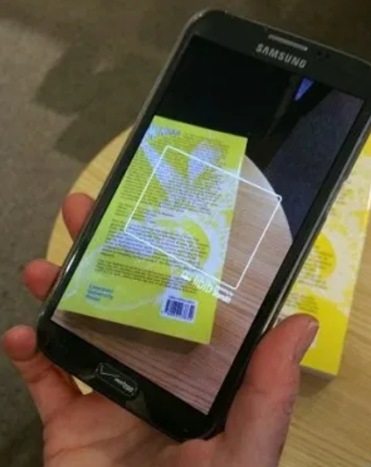

# Calibre Hardcopy Entry
A tool to add and represent hardcopies on the Open Source Calibre library software.

<!-- TODO: Check whether links work-->
<!-- TODO: -->
<!-- TODO: -->
<!-- TODO: -->
## Contents

[Project Overview](#project-overview) |
[Getting Started](#getting-started) |
[Technologies Used](#technologies-used) |
[Result](#result) |
[Development Lifecycle](#development-lifecycle) |
[Wins](#wins) |
[Challenges](#challenges) |
[Bugs and Future Improvements](#bugs-and-future-improvements) |
[Key Learnings](#key-learnings) |


## Project overview

Calibre is an open-ebook management system, for which, this project enables adding records for physical copies. It relies on libib (another opensource library management app) for use of its barcorde scanner and .csv export function. Once .csv file has been exported a placeholder .pdf is created to be imported into calibre along with book info.

Calibre has a useful metadata function that can "fill in the blanks" of ISBNs, publisher info etc to make a comprehensive record if there is missing info.

The project then has a secondary function to stamp "HARDCOPY" and "Owner's" for a certain owner, on the .jpg file represented in the calibre package. This enables distinguising against virtual ebook copies.
<table>
  <thead>
    <tr>
      <th>Scan Book Barcode</th>
      <th>Export from libib</th>
      <th>"Hardcopy" record in Calibre</th>
    </tr>
  </thead>
  <tbody>
    <tr>
      <td align="center">
        
      </td>
      <td align="center">
        
      </td>
      <td align="center">
        
      </td>
    </tr>
  </tbody>
</table>


## Getting Started

To recreate this project please do the following:

### Have pre-requisites

- Libib account
- Download Calibre 

### Follow Steps

- Clone or download the this repo:

```
git@github.com:nedd-ludd/calibre-hardcopy-entry.git
```
- Install Calibre
- Download libib app on mobile device.
- Create collection on libib
- Scan in book barcodes and export .csv
- Create .env file with the following variables:
    - "INCOMING_CSV="
    - "DUMP_PDFS="
    - "CALIBRE_LIBRARY_PATH="
    - "CALIBRE_DB_PATH="
    - "USER_1_TAG=" ... 2, 3, -> n as appropriate
    - "OWNER_TAG="
- Create folder for pdfs and add to DUMP_PDFS
- Add location of Calibre Library, Calibre sqlite db to .env vars
- Add user name to user tag in .env
- Add name of ownder to .env
- from cli run:
```
python ingest_hardcopies.py
```
- 
*In Calibre software:*
- Go to - Add books options > Control the adding of books > Reading meta data

    - De select "Read metadate from file contents..."
    

    - Add following Regular Expression:

    ```
    title(?P<title>[^@]+)@authors(?P<author>[^@]+)@isbn(?P<isbn>\d+)
    ```

- While in "Adding books", go to the "Adding actions" tab
    Add "Hardcopy" and "Name's" (replace Name with actual name)
    

- Add books - and navigate to dump folder and select books:

- Download meta data and covers - right click on a book

- If failed to bring back meta data, fill in manually.

- in modify_covers.py, change user tag to match that in .env:

- from cli run:

```
python modify_covers.py
```

# Technologies Used
<table>
  <thead>
    <tr>
      <th>Type</th>
      <th>Technology</th>
    </tr>
  </thead>
  <tbody>
    <tr>
      <td style="border-bottom: 1px solid #ddd;">Operating Systems</td>
      <td style="border-bottom: 1px solid #ddd;">
        <ul>
          <li>Windows</li>
        </ul>
      </td>
    </tr>
    <tr>
      <td style="border-bottom: 1px solid #ddd;">Languages / Formats / Packaging</td>
      <td style="border-bottom: 1px solid #ddd;">
        <ul>
          <li>Python</li>
          <li>csv</li>
          <li>pip</li>
          <li>pip env</li>
        </ul>
      </td>
    </tr>
    <tr>
      <td style="border-bottom: 1px solid #ddd;">Python</td>
      <td style="border-bottom: 1px solid #ddd;">
        <ul>
          <li>reportlab</li>
          <li>Pillow</li>
        </ul>
      </td>
    </tr>
    <tr>
      <td style="border-bottom: 1px solid #ddd;">Code Editors</td>
      <td style="border-bottom: 1px solid #ddd;">
        <ul>
          <li>Visual Studio Code</li>
        </ul>
      </td>
    </tr>
    <tr>
      <td style="border-bottom: 1px solid #ddd;">Project Management / Version Control</td>
      <td style="border-bottom: 1px solid #ddd;">
        <ul>
          <li>GitHub</li>
        </ul>
      </td>
    </tr>
  </tbody>
</table>


## Result
The below image is the Calibre search for "Hardcopy" which returns what has been entered and stamped.


There is a placeholder .pdf present but on opening it only has:


# Development Lifecycle

This was a small project, I pretty much made it up as I went along. I made sure to regularly commits and pushe back to GitHub.

### Execution

The successful order of development was the same as listed in the [Getting Started](#getting-started) section.

## Wins

I got something working quickly, and crudely, then improved.
Was good to seperate into folder/ modules, found that easier to work with.

## Challenges
- Couldnt get pypdf to work as a package
- Was difficult to work out how to use pillow to get geometry of text on angle when using Pillow

## Bugs and Future Improvements
- USER_?_TAG and OWNER_TAG not DRY, they represent same data and are two places to make changes. Neet to combine as one, maybe have user input as "Name" for name of ownder in pdf, then can add "'s" for ownership stamp on cover.

- Could add to command to pipenv so that can execute from commandline in pipenv shell.